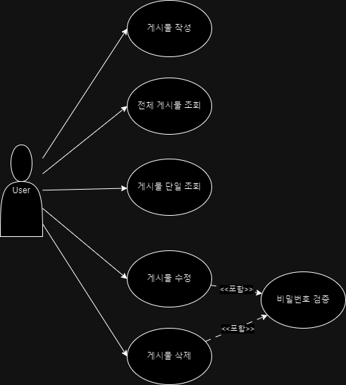
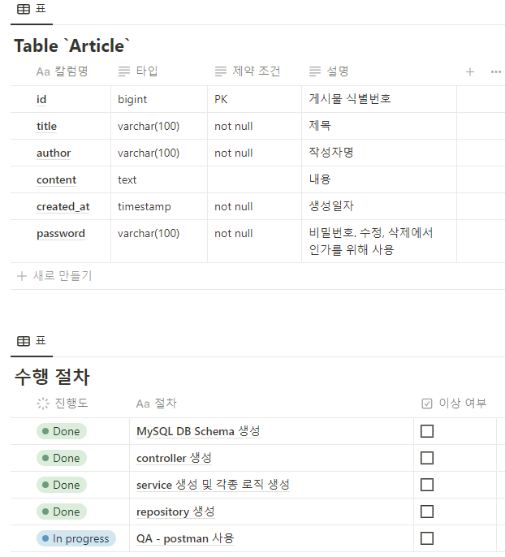

# Lv1-Assignment

.PNG)

.PNG)

.PNG)

---

# 서버 구축 시, 고려 사항들.

Q. 수정, 삭제 API의 request를 어떤 방식으로 사용하셨나요? (param, query, body)

A. 

Q. 어떤 상황에 어떤 방식의 request를 써야하나요?

A. 

Q. RESTful한 API를 설계했나요? 어떤 부분이 그런가요? 어떤 부분이 그렇지 않나요?

A. 

Q. 적절한 관심사 분리를 적용하였나요? (Controller, Repository, Service)

A. 

Q. API 명세서 작성 가이드라인을 검색하여 직접 작성한 API 명세서와 비교해보세요!

A. 

